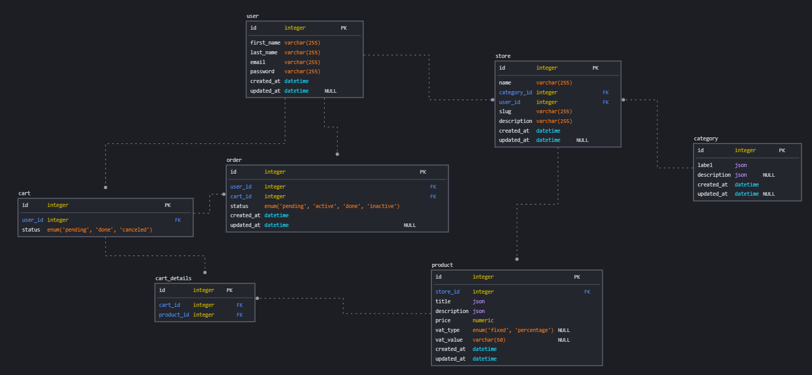

<p align="center">
    <br>
    <a href="https://zid.sa" target="_blank">
        
    </a>
</p>


## ZID API TASK

Task Requirements
```
Please create a Laravel API e-commerce project to achieve these requirements:
-+-+-+-+-+-+-+-+-+-+-+-+-+-+-+-+-+-+-+-+-+-+-+-+-+-+-+-+-+-+-+-+-+-+-+-+-+-+-+-+
    1. Visitors can register/login either as merchants or end consumers.
    2. Merchants can set their store name.
    3. Merchants can decide if the VAT is included in the products price or should be calculated
    from the products price.
    4. (optional) Merchants can set shipping cost
    5. Merchants can set VAT percentage in case the VAT isn’t included in the product’s price.
    6. Merchants can add products with multilingual names and descriptions and prices.
    7. Merchants can end-consumers to add products to their carts.
    8. Calculate the cart’s total considering these subtotals:
    a. Cart’s products prices.
    b. Store VAT settings.
    c. (optional) Store shipping cost.
```

## HOW TO RUN
1. Clone the  project.
2. Run:
   1. ```composer install```
   2. ```cp .env.example .env```
   3. ```php artisan key:generate```
   4. ```php artisan jwt:secret```
3. Create A new DataBase in your mysql env ```CREATE DATABASE zid_backend;```
4. Change the DataBase connection info in ```.env``` to match your database,
5. Run ```php artisan migrate```
6. Serve the project by running ```php artisan serve```

## APIs Collection
Here is the [PostMan Collection](https://drive.google.com/file/d/1kXsc9fAgICVIvkckmcAPo1OkpSN_da2_/view?usp=sharing) for all APIs.

## DATABASE ERD

